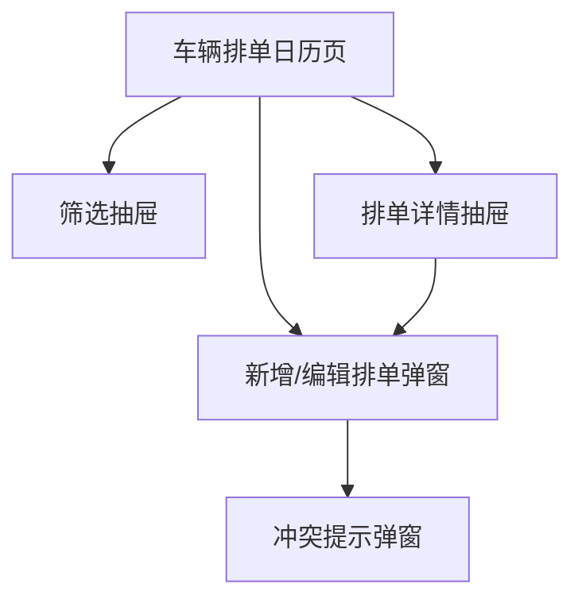

## 1. Product Overview

面向调度/车队人员的「车辆排单日历」低保真原型说明，用日历/时间轴方式查看与安排车辆任务。
核心目标：快速查看某日/周的车辆占用情况，并通过弹窗/抽屉完成新增与查看。

## 2. Core Features

### 2.1 Feature Module

本产品原型由以下页面组成：

1. **车辆排单日历页**：顶部工具栏、左侧资源列表、中心日历网格/时间轴、排单卡片、图例与状态、关键弹窗/抽屉入口。

### 2.2 Page Details

| Page Name | Module Name   | Feature description                                     |
| --------- | ------------- | ------------------------------------------------------- |
| 车辆排单日历页   | 顶部工具栏         | 切换日期范围（上一段/下一段/今天）；切换视图（日/周/月/列表）；搜索；打开筛选抽屉；触发“新增排单”弹窗。 |
| 车辆排单日历页   | 左侧资源列表（车辆/车组） | 展示可排车辆列表（可折叠分组）；支持资源搜索；支持选择资源以聚焦日历内容。                   |
| 车辆排单日历页   | 日历主体（网格/时间轴）  | 展示日期列与时间刻度；支持纵向滚动；展示“当前时间线/今天标识”；在网格中承载排单卡片。            |
| 车辆排单日历页   | 排单卡片（事件块）     | 以卡片块显示任务（标题/车牌/时间段/状态色）；点击打开“排单详情抽屉”；悬浮显示快捷信息（tooltip）。 |
| 车辆排单日历页   | 状态图例与提示       | 展示不同状态颜色/样式含义；展示加载/空态/错误提示占位。                           |
| 车辆排单日历页   | 关键弹窗/抽屉（结构清单） | 统一承载新增、详情、筛选、冲突提示等交互（见下方“关键弹窗/抽屉结构”）。                   |

**关键弹窗/抽屉结构（页面内，不单独成页）**

* 新增/编辑排单弹窗（Modal）

  * Header：标题 + 关闭

  * Body：基础信息表单（任务标题、车辆/车组选择、起止时间、状态、备注）

  * Footer：取消 / 保存

* 排单详情抽屉（Right Drawer）

  * Header：任务标题 + 状态标签 + 关闭

  * Body：信息分组/Tab（概览、时间、车辆、备注）

  * Footer：编辑 / 取消排单（或关闭）

* 筛选抽屉（Left/Right Drawer）

  * 分组筛选：状态多选、车辆类型/分组、时间范围（可选）

  * 操作：重置 / 应用

* 冲突提示弹窗（Modal）

  * 冲突原因列表（时间重叠/资源占用）

  * 操作：返回修改 / 仍然保存（若允许）

* 快捷操作浮层（Popover / Context Menu）

  * 操作：查看详情、编辑、复制、删除（如需）

## 3. Core Process

* 日历浏览流程：进入日历页 → 选择日期范围/视图 →（可选）选择左侧车辆或使用筛选 → 在日历主体中查看排单卡片 → 点击卡片打开详情抽屉。

* 新增排单流程：点击“新增排单” → 在弹窗填写车辆与时间等信息 → 保存 → 新卡片出现在对应日期/时间位置。

