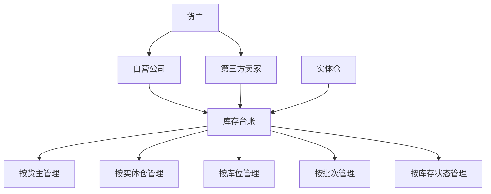
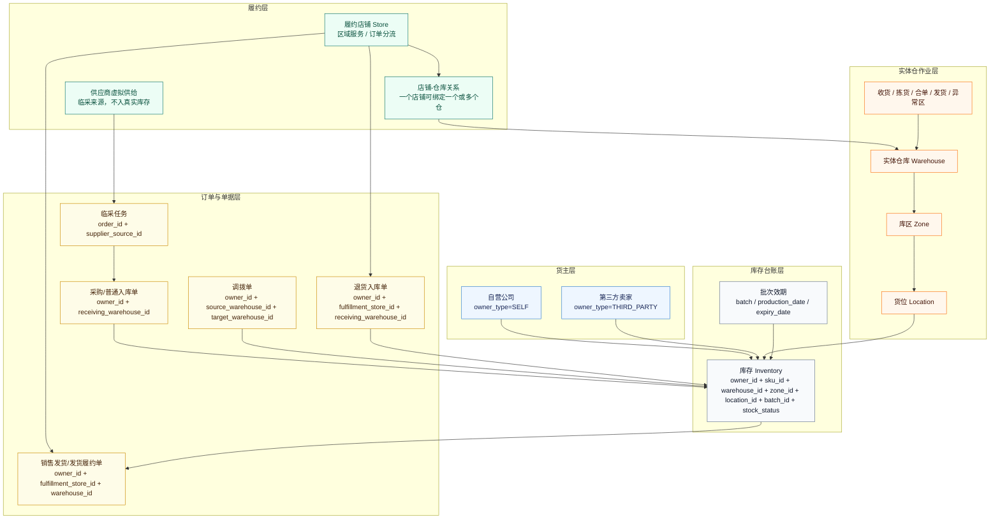

# 库存归属与作业维度模型图

## 1. 设计口径

库存归属、业务履约、现场作业不要混用同一个概念：

| 维度                     | 负责表达       |
| ---------------------- | ---------- |
| 货主 Owner               | 这批货是谁的     |
| 履约店铺 Store             | 订单由哪个区域服务  |
| 实体仓 Warehouse          | 货在哪里、谁现场作业 |
| 供应商虚拟供给 SupplierSource | 临采商品从哪里采购  |
| 库存 Inventory           | 真实入仓可盘点库存  |

## 4.3 库存归属与作业维度模型图

### 图示

### PRD正文

系统中的库存管理必须建立在明确、稳定的对象分层之上。首先，货主是库存归属、账务归属和费用归集的唯一主体，在当前业务范围内只能是自营公司或第三方卖家；其次，履约店铺表示订单归属和配送承接关系，用于决定订单由哪个店铺或前置仓负责履约，但不等同于库存所有者；再次，实体仓是真实库存所在和仓内作业发生地，所有收货、上架、备货、复核、出库等动作都围绕实体仓展开；最后，供应商虚拟供给仅表示自营业务中的临采来源，不是真实库存节点，也不应纳入库存台账的归属主体。

基于上述原则，系统中的库存台账应围绕货主 + 实体仓 + 库位 + 批次 + 库存状态建立，确保库存数据既能支撑仓内精细化作业，又能满足多货主独立核算要求。这样设计的意义在于：一方面，自营库存与第三方卖家库存可以共用一套仓内执行能力，但在库存归属、账务结算和费用核算上保持严格隔离；另一方面，履约店铺和供应商虚拟供给不会被错误纳入库存归属模型，从而避免后续在库存查询、订单路由、异常处理和费用核算中出现口径混乱。该模型是后续所有订单履约、库存扣减、仓内作业和经营核算能力的基础数据框架。

## 2. 自营业务模型图

## 3. 单据关联建议

| 单据       | 必填维度                                                                         | 可选维度                                 | 说明                |
| -------- | ---------------------------------------------------------------------------- | ------------------------------------ | ----------------- |
| 库存台账     | `owner_id`、`warehouse_id`、`location_id`、`batch_id`、`stock_status`            | 不使用 `store_id` 作为库存归属字段               | 店铺不是库存所有者         |
| 销售发货/发货履约单 | `owner_id`、`fulfillment_store_id`、`warehouse_id`                             | `source_order_id`                    | 必须关联履约店铺        |
| 退货入库单    | `owner_id`、`fulfillment_store_id`、`receiving_warehouse_id`                    | `source_order_id`                    | 必须关联履约店铺，原则上继承原销售发货履约单 |
| 采购入库单    | `owner_id`、`receiving_warehouse_id`                                          | `supplier_id`      | 不要求选择店铺        |
| 调拨出入库单   | `owner_id`、`source_warehouse_id`、`target_warehouse_id`                        | `transfer_reason`                   | 不要求选择店铺，按货主+仓库执行 |
| 临采回仓入库   | `owner_id`、`receiving_warehouse_id`、`source_order_id`                         | `supplier_source_id`                 | 不单独选择店铺；如关联销售发货履约单，则从原单继承店铺做追溯 |
