# 自研仓储系统（WMS）系统间时序图

本文档按“整体主流程 -> 主链路场景 -> 仓内执行 -> 库存补货与入库 -> 售后逆向 -> 物流协同”进行编排。\
统一口径如下：

- WMS 对上只对接一个 `第三方电商系统`
- 风控、运营后台、客服等属于第三方电商系统内部能力，不作为 WMS 上游独立系统展开
- 全文统一使用 `备货`，不再使用 `揽货`
- `支付回调` 不直接进入 WMS，WMS 接收的是 `订单状态变更` 或 `可履约指令`

## 第一部分：第三方电商系统向WMS下单整体主流程

这一部分只回答一个问题：第三方电商系统把订单交给 WMS 后，整体主链路到底怎么走。先看这组图，可以先建立“接单、预扣、激活作业、发货、物流回传”的完整认知，避免一上来就陷进局部细节里。

一句话理解：第三方电商系统负责把具备履约条件的订单交给 WMS，WMS 负责把订单变成库存占用、仓内作业和物流履约，最后再把结果回传给第三方电商系统。

### 1. 第三方电商系统向WMS下单整体主流程

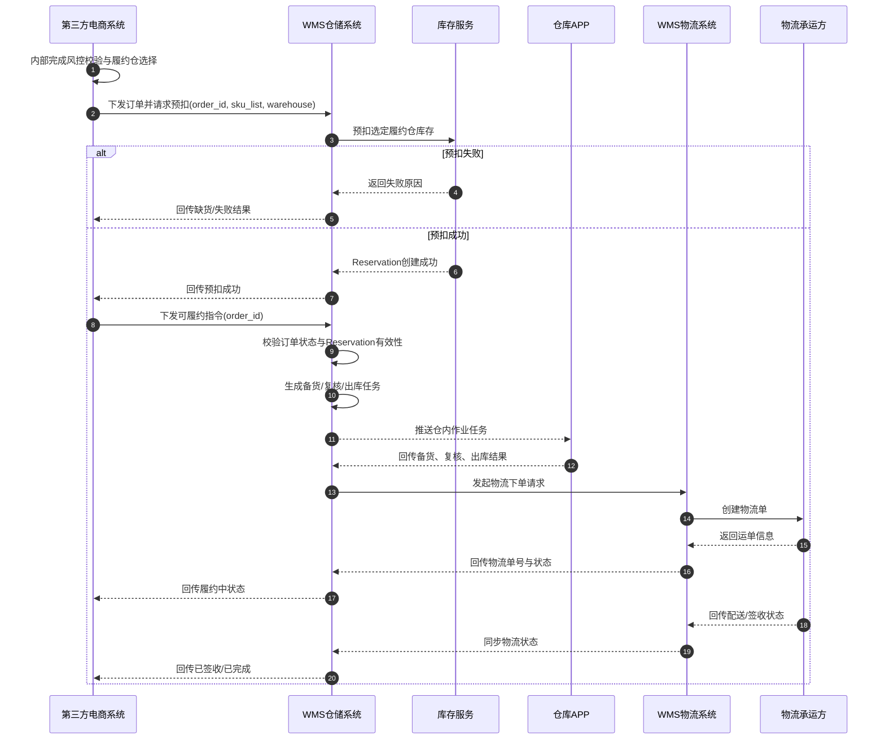
```mermaid
sequenceDiagram
    autonumber
    participant Mall as 第三方电商系统
    participant WMS as WMS仓储系统
    participant Inv as 库存服务
    participant App as 仓库APP
    participant WMSL as WMS物流系统
    participant Carrier as 物流承运方

    Mall->>Mall: 内部完成风控校验与履约仓选择
    Mall->>WMS: 下发订单并请求预扣(order_id, sku_list, warehouse)
    WMS->>Inv: 预扣选定履约仓库存
    alt 预扣失败
        Inv-->>WMS: 返回失败原因
        WMS-->>Mall: 回传缺货/失败结果
    else 预扣成功
        Inv-->>WMS: Reservation创建成功
        WMS-->>Mall: 回传预扣成功
        Mall->>WMS: 下发可履约指令(order_id)
        WMS->>WMS: 校验订单状态与Reservation有效性
        WMS->>WMS: 生成备货/复核/出库任务
        WMS-->>App: 推送仓内作业任务
        App-->>WMS: 回传备货、复核、出库结果
        WMS->>WMSL: 发起物流下单请求
        WMSL->>Carrier: 创建物流单
        Carrier-->>WMSL: 返回运单信息
        WMSL-->>WMS: 回传物流单号与状态
        WMS-->>Mall: 回传履约中状态
        Carrier-->>WMSL: 回传配送/签收状态
        WMSL-->>WMS: 同步物流状态
        WMS-->>Mall: 回传已签收/已完成
    end
```

## 第二部分：主链路关键场景

这一部分把整体主流程拆成关键场景逐个说明，重点解决“哪里可能失败、失败后怎么回滚、什么时点开始进入仓内执行、订单为什么会被释放”这些最容易在对接时扯不清的问题。

### 2. 下单预扣库存（按第三方电商系统已选履约仓）

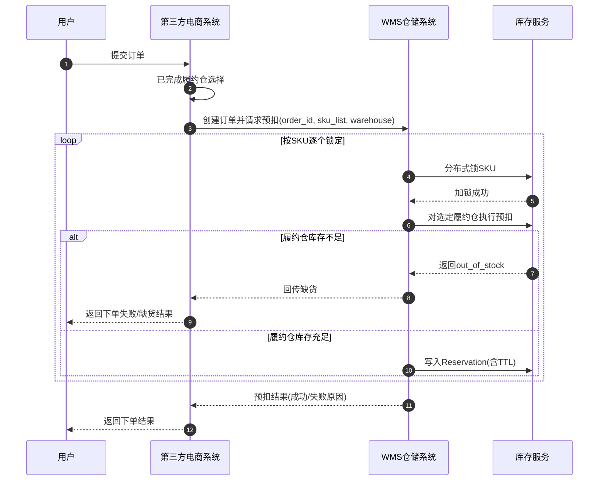
```mermaid
sequenceDiagram
    autonumber
    participant User as 用户
    participant Mall as 第三方电商系统
    participant WMS as WMS仓储系统
    participant Inv as 库存服务

    User->>Mall: 提交订单
    Mall->>Mall: 已完成履约仓选择
    Mall->>WMS: 创建订单并请求预扣(order_id, sku_list, warehouse)

    loop 按SKU逐个锁定
        WMS->>Inv: 分布式锁SKU
        Inv-->>WMS: 加锁成功
        WMS->>Inv: 对选定履约仓执行预扣
        alt 履约仓库存不足
            Inv-->>WMS: 返回out_of_stock
            WMS-->>Mall: 回传缺货
            Mall-->>User: 返回下单失败/缺货结果
        else 履约仓库存充足
            WMS->>Inv: 写入Reservation(含TTL)
        end
    end

    WMS-->>Mall: 预扣结果(成功/失败原因)
    Mall-->>User: 返回下单结果
```

### 3. 恶意下单风控拦截与预扣释放

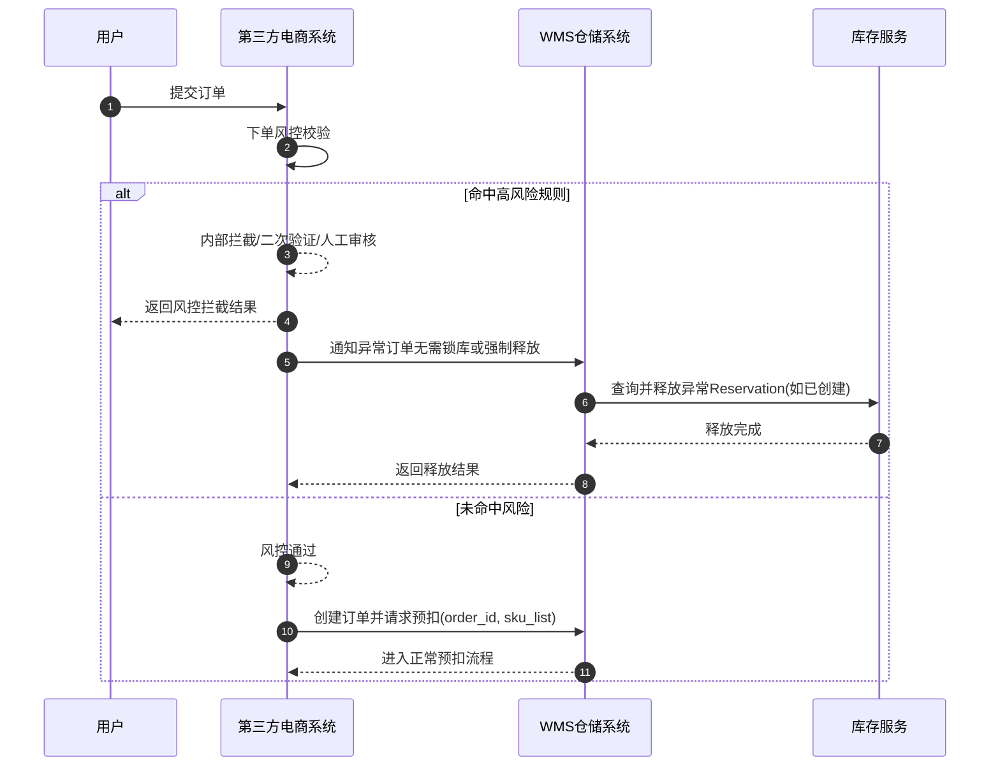
```mermaid
sequenceDiagram
    autonumber
    participant User as 用户
    participant Mall as 第三方电商系统
    participant WMS as WMS仓储系统
    participant Inv as 库存服务

    User->>Mall: 提交订单
    Mall->>Mall: 下单风控校验
    alt 命中高风险规则
        Mall-->>Mall: 内部拦截/二次验证/人工审核
        Mall-->>User: 返回风控拦截结果
        Mall->>WMS: 通知异常订单无需锁库或强制释放
        WMS->>Inv: 查询并释放异常Reservation(如已创建)
        Inv-->>WMS: 释放完成
        WMS-->>Mall: 返回释放结果
    else 未命中风险
        Mall-->>Mall: 风控通过
        Mall->>WMS: 创建订单并请求预扣(order_id, sku_list)
        WMS-->>Mall: 进入正常预扣流程
    end
```

### 4. 订单变更为可履约后激活仓内任务

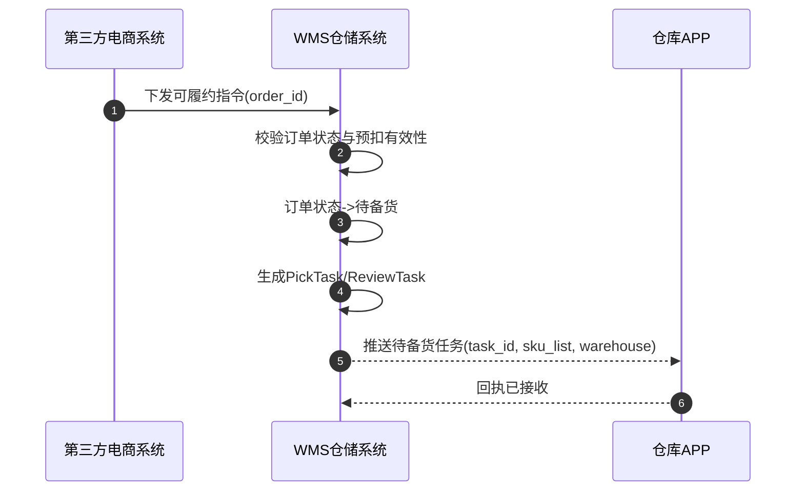
```mermaid
sequenceDiagram
    autonumber
    participant Mall as 第三方电商系统
    participant WMS as WMS仓储系统
    participant App as 仓库APP

    Mall->>WMS: 下发可履约指令(order_id)
    WMS->>WMS: 校验订单状态与预扣有效性
    WMS->>WMS: 订单状态->待备货
    WMS->>WMS: 生成PickTask/ReviewTask
    WMS-->>App: 推送待备货任务(task_id, sku_list, warehouse)
    App-->>WMS: 回执已接收
```

### 5. 取消或超时释放预扣库存

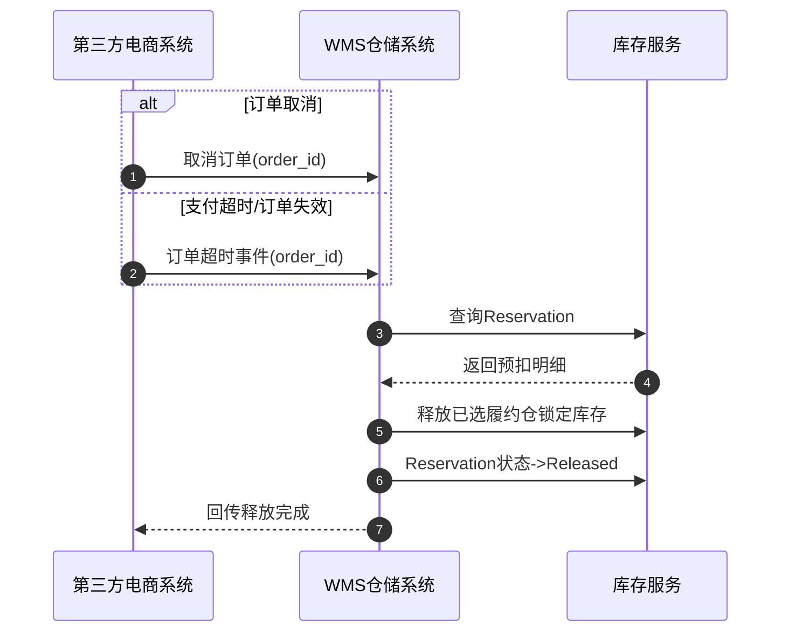
```mermaid
sequenceDiagram
    autonumber
    participant Mall as 第三方电商系统
    participant WMS as WMS仓储系统
    participant Inv as 库存服务

    alt 订单取消
        Mall->>WMS: 取消订单(order_id)
    else 支付超时/订单失效
        Mall->>WMS: 订单超时事件(order_id)
    end

    WMS->>Inv: 查询Reservation
    Inv-->>WMS: 返回预扣明细
    WMS->>Inv: 释放已选履约仓锁定库存
    WMS->>Inv: Reservation状态->Released
    WMS-->>Mall: 回传释放完成
```

### 6. 整单预扣失败回滚

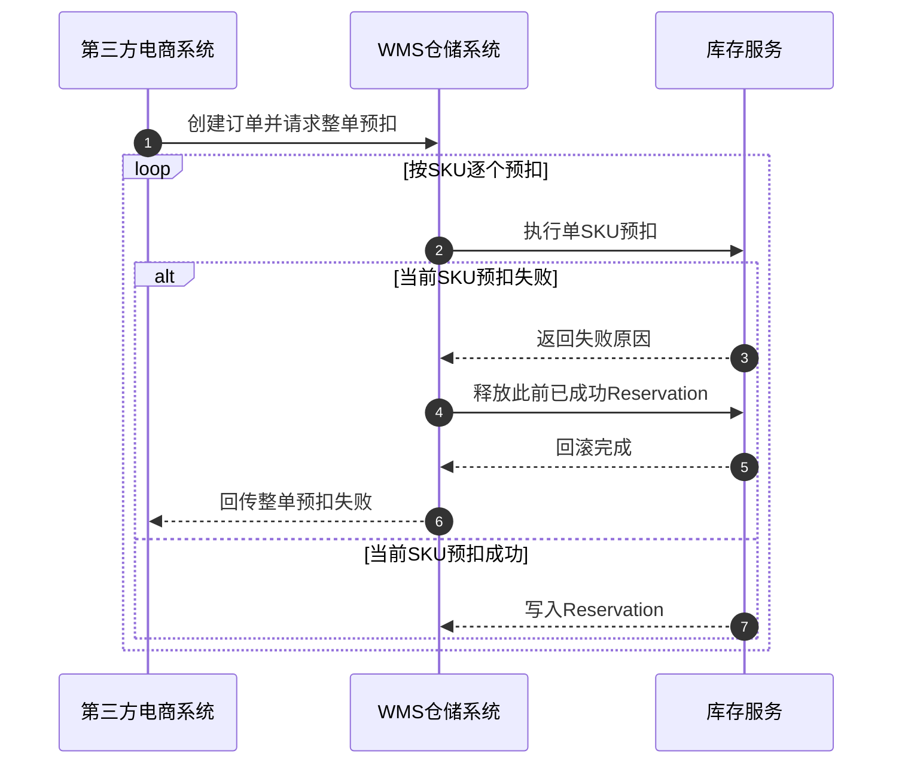
```mermaid
sequenceDiagram
    autonumber
    participant Mall as 第三方电商系统
    participant WMS as WMS仓储系统
    participant Inv as 库存服务

    Mall->>WMS: 创建订单并请求整单预扣
    loop 按SKU逐个预扣
        WMS->>Inv: 执行单SKU预扣
        alt 当前SKU预扣失败
            Inv-->>WMS: 返回失败原因
            WMS->>Inv: 释放此前已成功Reservation
            Inv-->>WMS: 回滚完成
            WMS-->>Mall: 回传整单预扣失败
        else 当前SKU预扣成功
            Inv-->>WMS: 写入Reservation
        end
    end
```

### 7. 出库发货与物流状态回传闭环

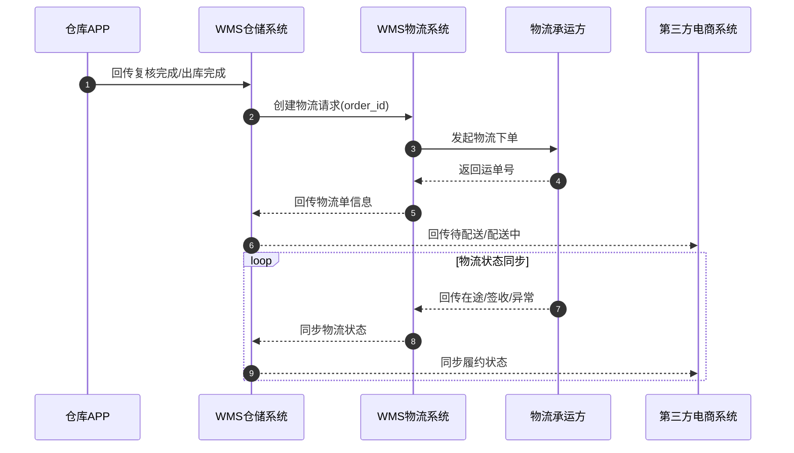
```mermaid
sequenceDiagram
    autonumber
    participant App as 仓库APP
    participant WMS as WMS仓储系统
    participant WMSL as WMS物流系统
    participant Carrier as 物流承运方
    participant Mall as 第三方电商系统

    App->>WMS: 回传复核完成/出库完成
    WMS->>WMSL: 创建物流请求(order_id)
    WMSL->>Carrier: 发起物流下单
    Carrier-->>WMSL: 返回运单号
    WMSL-->>WMS: 回传物流单信息
    WMS-->>Mall: 回传待配送/配送中

    loop 物流状态同步
        Carrier-->>WMSL: 回传在途/签收/异常
        WMSL-->>WMS: 同步物流状态
        WMS-->>Mall: 同步履约状态
    end
```

## 第三部分：仓内执行场景

这一部分只关注仓内执行，不再重复讲上游交易逻辑。它解决的是“任务下到仓库后怎么做、扫码怎么校验、异常怎么拦截、人工怎么强解锁”，避免业务侧和仓内作业侧把职责混在一起。

### 8. 仓库APP备货扫码与核销闭环

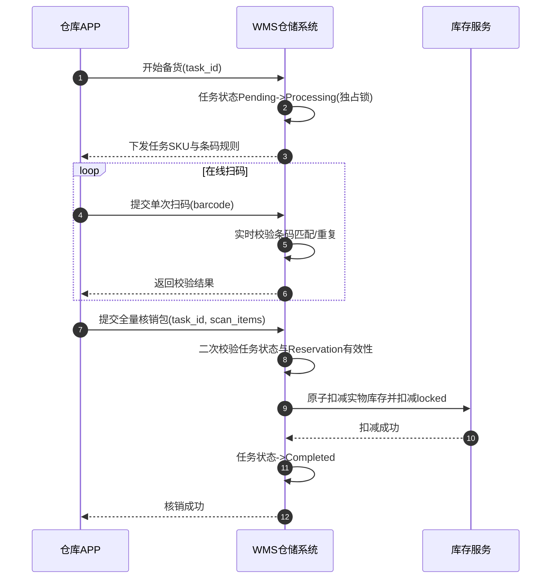
```mermaid
sequenceDiagram
    autonumber
    participant App as 仓库APP
    participant WMS as WMS仓储系统
    participant Inv as 库存服务

    App->>WMS: 开始备货(task_id)
    WMS->>WMS: 任务状态Pending->Processing(独占锁)
    WMS-->>App: 下发任务SKU与条码规则

    loop 在线扫码
        App->>WMS: 提交单次扫码(barcode)
        WMS->>WMS: 实时校验条码匹配/重复
        WMS-->>App: 返回校验结果
    end

    App->>WMS: 提交全量核销包(task_id, scan_items)
    WMS->>WMS: 二次校验任务状态与Reservation有效性
    WMS->>Inv: 原子扣减实物库存并扣减locked
    Inv-->>WMS: 扣减成功
    WMS->>WMS: 任务状态->Completed
    WMS-->>App: 核销成功
```

### 9. 后端二次校验失败拦截

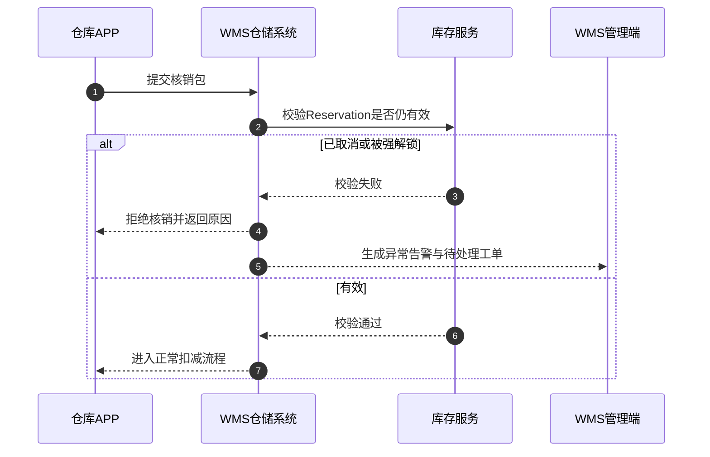
```mermaid
sequenceDiagram
    autonumber
    participant App as 仓库APP
    participant WMS as WMS仓储系统
    participant Inv as 库存服务
    participant Admin as WMS管理端

    App->>WMS: 提交核销包
    WMS->>Inv: 校验Reservation是否仍有效
    alt 已取消或被强解锁
        Inv-->>WMS: 校验失败
        WMS-->>App: 拒绝核销并返回原因
        WMS-->>Admin: 生成异常告警与待处理工单
    else 有效
        Inv-->>WMS: 校验通过
        WMS-->>App: 进入正常扣减流程
    end
```

### 10. 指令干预中心强解锁

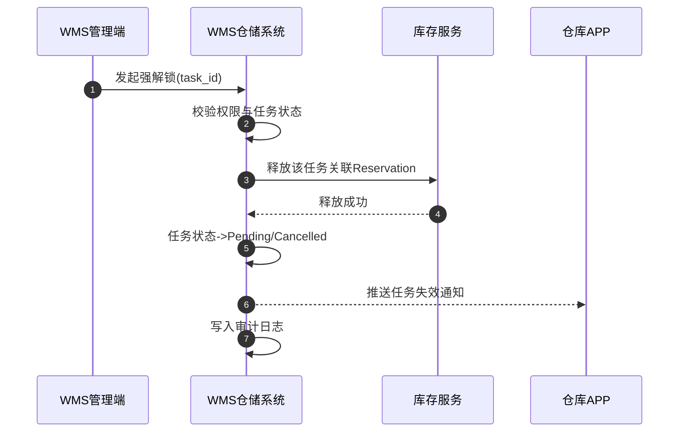
```mermaid
sequenceDiagram
    autonumber
    participant Admin as WMS管理端
    participant WMS as WMS仓储系统
    participant Inv as 库存服务
    participant App as 仓库APP

    Admin->>WMS: 发起强解锁(task_id)
    WMS->>WMS: 校验权限与任务状态
    WMS->>Inv: 释放该任务关联Reservation
    Inv-->>WMS: 释放成功
    WMS->>WMS: 任务状态->Pending/Cancelled
    WMS-->>App: 推送任务失效通知
    WMS->>WMS: 写入审计日志
```

## 第四部分：库存补货与入库场景

这一部分解决的是库存为什么会变、缺货后怎么补、补回来的货怎么入账。前面主链路讲的是“卖出去”，这里讲的是“货从哪里来、怎么补回来、怎么进入真实库存台账”。

### 11. 门店库存不足缺货回传

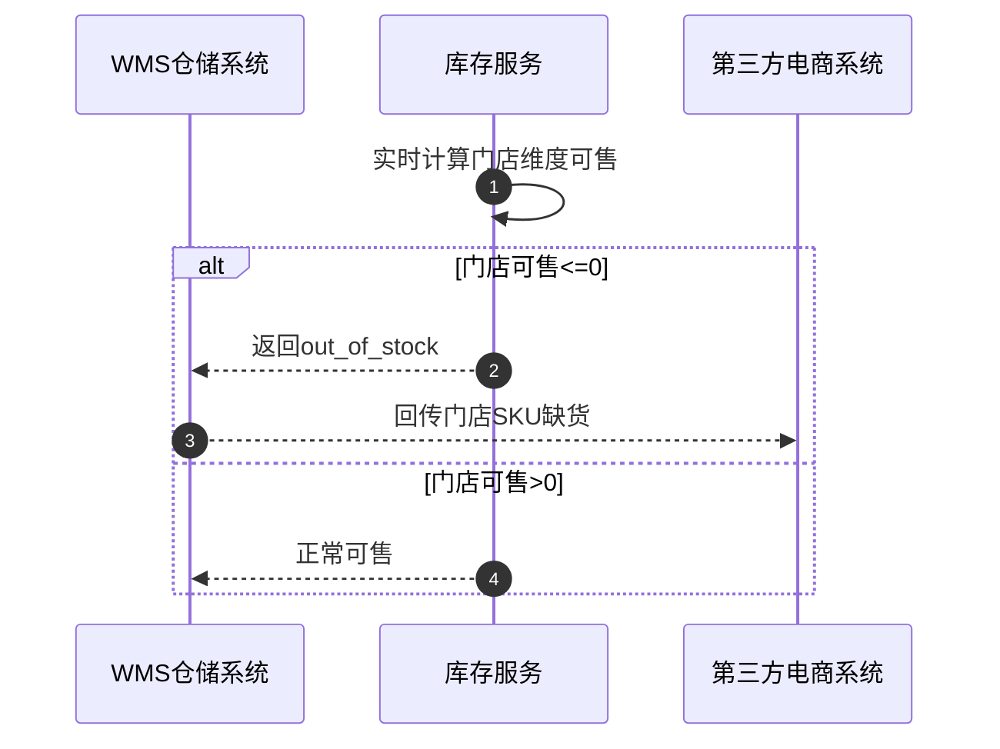
```mermaid
sequenceDiagram
    autonumber
    participant WMS as WMS仓储系统
    participant Inv as 库存服务
    participant Mall as 第三方电商系统

    Inv->>Inv: 实时计算门店维度可售
    alt 门店可售<=0
        Inv-->>WMS: 返回out_of_stock
        WMS-->>Mall: 回传门店SKU缺货
    else 门店可售>0
        Inv-->>WMS: 正常可售
    end
```

### 12. 门店调拨补货（门店->门店）

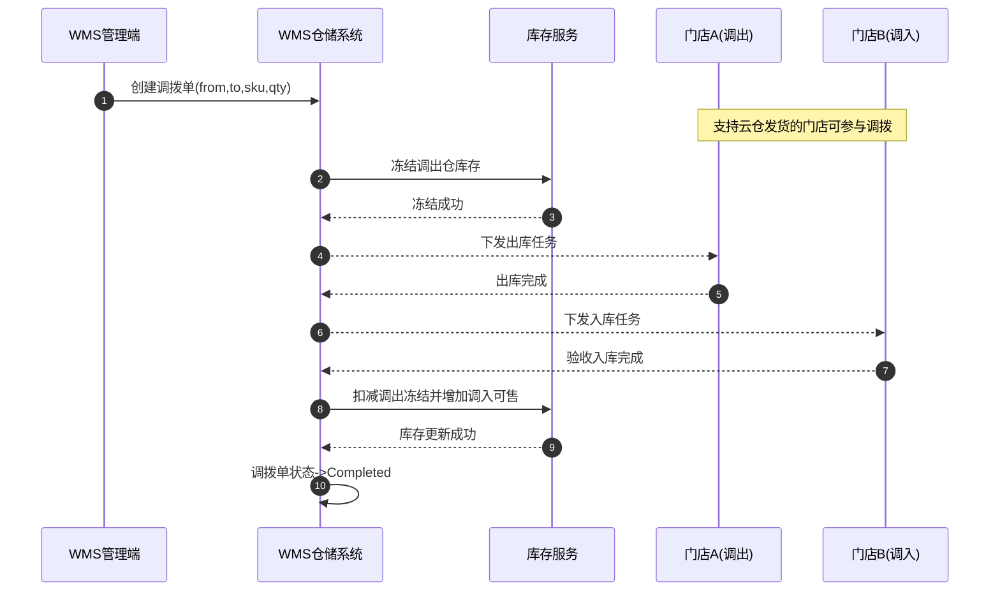
```mermaid
sequenceDiagram
    autonumber
    participant Admin as WMS管理端
    participant WMS as WMS仓储系统
    participant Inv as 库存服务
    participant Src as 门店A(调出)
    participant Dst as 门店B(调入)

    Admin->>WMS: 创建调拨单(from,to,sku,qty)
    Note over Src,Dst: 支持云仓发货的门店可参与调拨
    WMS->>Inv: 冻结调出仓库存
    Inv-->>WMS: 冻结成功
    WMS-->>Src: 下发出库任务
    Src-->>WMS: 出库完成
    WMS-->>Dst: 下发入库任务
    Dst-->>WMS: 验收入库完成
    WMS->>Inv: 扣减调出冻结并增加调入可售
    Inv-->>WMS: 库存更新成功
    WMS->>WMS: 调拨单状态->Completed
```

### 13. 采购/生产入库（带批次/有效期）

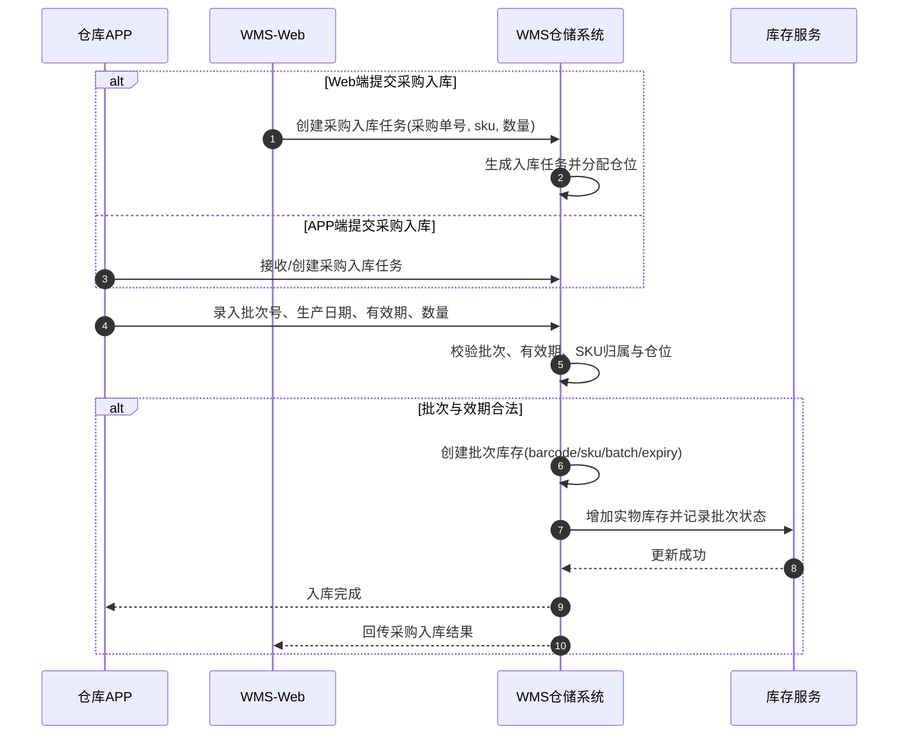
```mermaid
sequenceDiagram
    autonumber
    participant App as 仓库APP
    participant Web as WMS-Web
    participant WMS as WMS仓储系统
    participant Inv as 库存服务

    alt Web端提交采购入库
        Web->>WMS: 创建采购入库任务(采购单号, sku, 数量)
        WMS->>WMS: 生成入库任务并分配仓位
    else APP端提交采购入库
        App->>WMS: 接收/创建采购入库任务
    end

    App->>WMS: 录入批次号、生产日期、有效期、数量
    WMS->>WMS: 校验批次、有效期、SKU归属与仓位
    alt 批次与效期合法
        WMS->>WMS: 创建批次库存(barcode/sku/batch/expiry)
        WMS->>Inv: 增加实物库存并记录批次状态
        Inv-->>WMS: 更新成功
        WMS-->>App: 入库完成
        WMS-->>Web: 回传采购入库结果
    end
```

### 14. 现场扫码入库与条码绑定

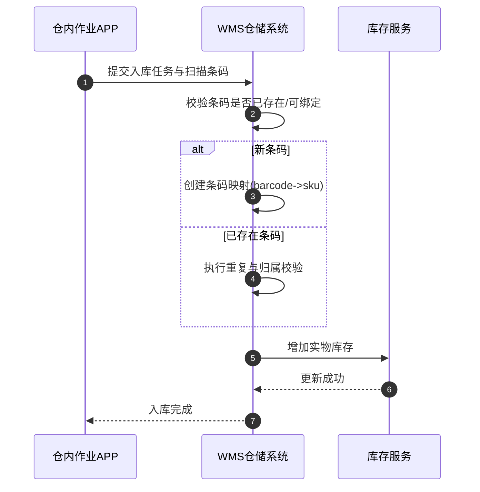
```mermaid
sequenceDiagram
    autonumber
    participant App as 仓内作业APP
    participant WMS as WMS仓储系统
    participant Inv as 库存服务

    App->>WMS: 提交入库任务与扫描条码
    WMS->>WMS: 校验条码是否已存在/可绑定
    alt 新条码
        WMS->>WMS: 创建条码映射(barcode->sku)
    else 已存在条码
        WMS->>WMS: 执行重复与归属校验
    end
    WMS->>Inv: 增加实物库存
    Inv-->>WMS: 更新成功
    WMS-->>App: 入库完成
```

## 第五部分：售后逆向场景

这一部分讲的是订单已经履约出去之后，退货和换货怎么重新回到 WMS。它的重点不是下单成功，而是逆向链路如何重新进入仓内作业和库存处理，避免售后结果只停留在第三方电商系统里。

### 15. 退货入库闭环

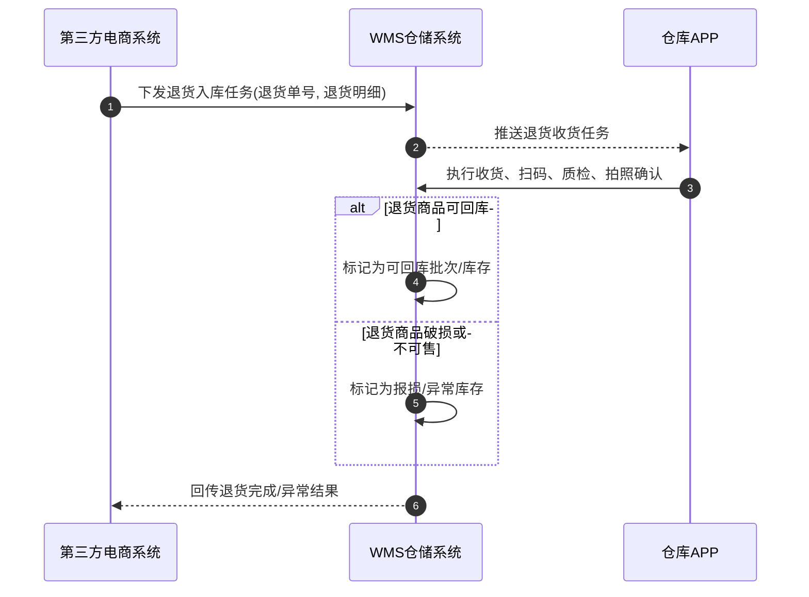
```mermaid
sequenceDiagram
    autonumber
    participant Mall as 第三方电商系统
    participant WMS as WMS仓储系统
    participant App as 仓库APP

    Mall->>WMS: 下发退货入库任务(退货单号, 退货明细)
    WMS-->>App: 推送退货收货任务
    App->>WMS: 执行收货、扫码、质检、拍照确认
    alt 退货商品可回库
        WMS->>WMS: 标记为可回库批次/库存
    else 退货商品破损或不可售
        WMS->>WMS: 标记为报损/异常库存
    end
    WMS-->>Mall: 回传退货完成/异常结果
```

### 16. 换货出库闭环

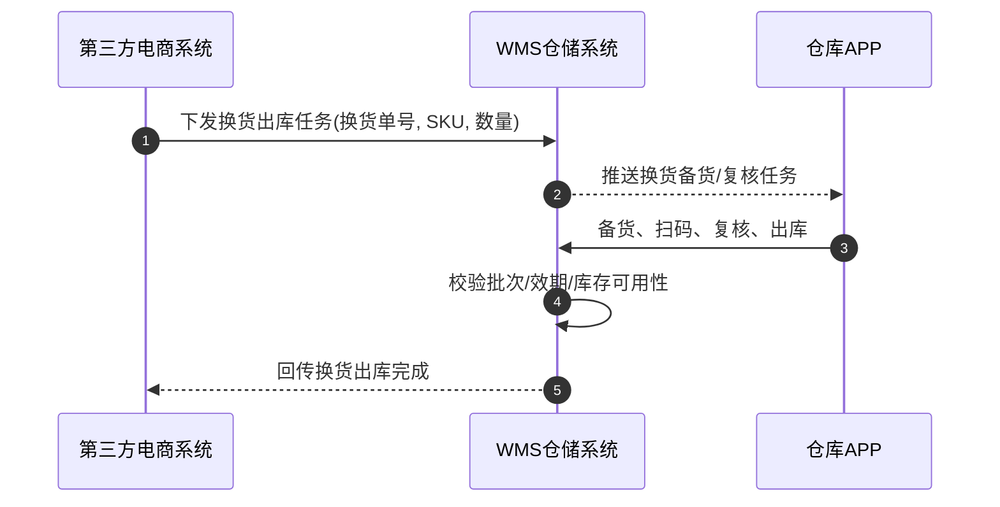
```mermaid
sequenceDiagram
    autonumber
    participant Mall as 第三方电商系统
    participant WMS as WMS仓储系统
    participant App as 仓库APP

    Mall->>WMS: 下发换货出库任务(换货单号, SKU, 数量)
    WMS-->>App: 推送换货备货/复核任务
    App->>WMS: 备货、扫码、复核、出库
    WMS->>WMS: 校验批次/效期/库存可用性
    WMS-->>Mall: 回传换货出库完成
```

## 第六部分：物流协同场景

这一部分只看 WMS 发货后的物流协同。它解决的是“运单怎么建、轨迹怎么回、异常怎么同步、第三方电商系统什么时候能拿到履约状态”，让物流链路和仓内链路清晰分开。

### 17. API物流下单

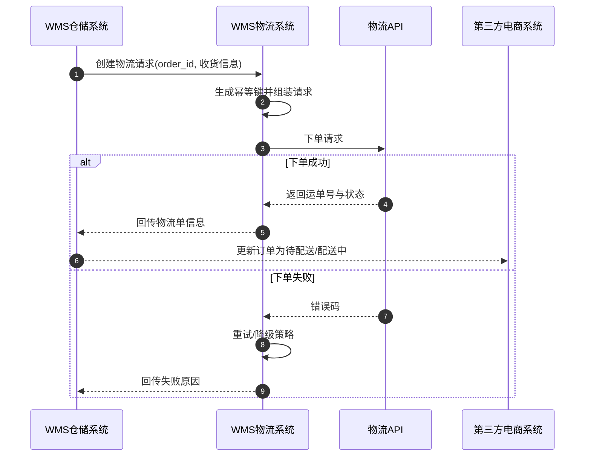
```mermaid
sequenceDiagram
    autonumber
    participant WMS as WMS仓储系统
    participant WMSL as WMS物流系统
    participant Carrier as 物流API
    participant Mall as 第三方电商系统

    WMS->>WMSL: 创建物流请求(order_id, 收货信息)
    WMSL->>WMSL: 生成幂等键并组装请求
    WMSL->>Carrier: 下单请求
    alt 下单成功
        Carrier-->>WMSL: 返回运单号与状态
        WMSL-->>WMS: 回传物流单信息
        WMS-->>Mall: 更新订单为待配送/配送中
    else 下单失败
        Carrier-->>WMSL: 错误码
        WMSL->>WMSL: 重试/降级策略
        WMSL-->>WMS: 回传失败原因
    end
```

### 18. 物流轨迹回传

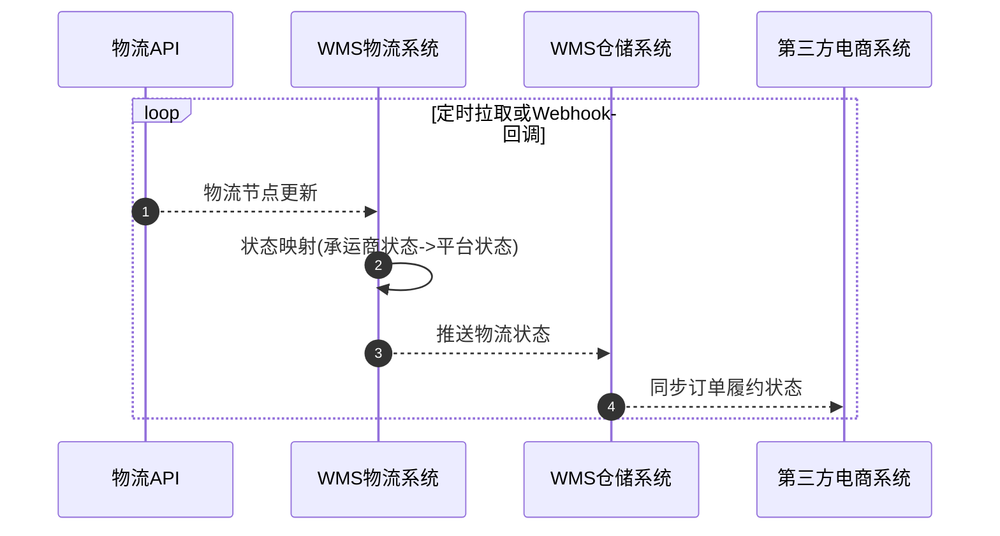
```mermaid
sequenceDiagram
    autonumber
    participant Carrier as 物流API
    participant WMSL as WMS物流系统
    participant WMS as WMS仓储系统
    participant Mall as 第三方电商系统

    loop 定时拉取或Webhook回调
        Carrier-->>WMSL: 物流节点更新
        WMSL->>WMSL: 状态映射(承运商状态->平台状态)
        WMSL-->>WMS: 推送物流状态
        WMS-->>Mall: 同步订单履约状态
    end
```

### 19. 手工物流下单与状态回传

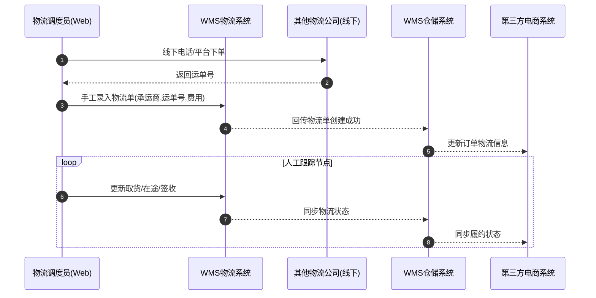
```mermaid
sequenceDiagram
    autonumber
    participant Dispatcher as 物流调度员(Web)
    participant WMSL as WMS物流系统
    participant Carrier as 其他物流公司(线下)
    participant WMS as WMS仓储系统
    participant Mall as 第三方电商系统

    Dispatcher->>Carrier: 线下电话/平台下单
    Carrier-->>Dispatcher: 返回运单号
    Dispatcher->>WMSL: 手工录入物流单(承运商,运单号,费用)
    WMSL-->>WMS: 回传物流单创建成功
    WMS-->>Mall: 更新订单物流信息

    loop 人工跟踪节点
        Dispatcher->>WMSL: 更新取货/在途/签收
        WMSL-->>WMS: 同步物流状态
        WMS-->>Mall: 同步履约状态
    end
```

***

## 附：统一状态映射建议

### A. 订单状态

- 待支付
- 待备货
- 备货中
- 待发运
- 配送中
- 已完成
- 已取消

### B. 任务状态

- Pending
- Processing
- Completed
- Cancelled

### C. 物流状态

- 待下单
- 已下单待接单
- 已接单待取货
- 配送中
- 已签收
- 异常中
- 已取消

