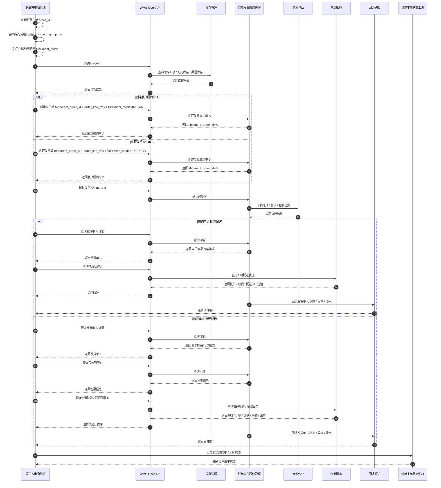

# 自营订单 WMS 系统流程图

## 1. 文档说明

本文档基于以下资料整理，用于说明自营业务场景下，第三方电商系统与 WMS 围绕订单履约的核心交互流程。

当前文档统一采用以下订单发货履约规则：

- 自营业务也统一通过“第三方电商系统”接入 WMS，使用 `business_type=SELF` 区分业务来源
- 一张自营订单可拆分为多张发货履约单
- 拆单最小颗粒度为商品行 `order_line_no`
- 每张发货履约单只允许一种履约模式：`INSTANT` / `EXPRESS`
- WMS 负责履约单执行，上游电商系统负责订单主单状态汇总

| 参考资料 | 路径 |
| ---- | ---- |
| WMS OpenAPI 接口清单 | `docs/需求文档/API接口/WMS-API/WMS-API接口清单.md` |

## 2. 自营订单主流程时序图

## 3. 自营订单多发货履约总览图

```mermaid
flowchart LR
    User["用户下单"]
    ECS["第三方电商系统<br/>business_type=SELF"]
    Order["订单主单<br/>order_id"]
    Lines["订单商品行<br/>order_line_no"]
    Split["商品行履约分组<br/>shipment_group_no"]

    ShipmentA["发货履约单 A<br/>shipment_order_id=A"]
    ShipmentB["发货履约单 B<br/>shipment_order_id=B"]

    Instant["即时配送履约<br/>INSTANT"]
    Express["快递配送履约<br/>EXPRESS"]

    Stock["前置仓现货"]
    Pick["仓内拣货 / 复核 / 包装"]
    Procure["供应商临采补货"]
    Inbound["内部入库处理<br/>收货 / 上架"]

    Callback["回调通知<br/>按 shipment_order_id 投递"]
    Aggregate["订单主单状态汇总"]
    Exception["异常处置<br/>缺货 / 拦截 / 取消 / 修改收货信息"]

    User --> ECS --> Order --> Lines --> Split
    Split -->|"行 1、行 2"| ShipmentA
    Split -->|"行 3"| ShipmentB

    ShipmentA --> Stock --> Pick --> Instant --> Callback
    ShipmentB --> Procure --> Inbound --> Pick --> Express --> Callback

    ShipmentA --> Exception
    ShipmentB --> Exception
    Callback --> Aggregate

    classDef main fill:#ecfdf5,stroke:#0f766e,color:#064e3b;
    classDef stock fill:#eef6ff,stroke:#2f7dd1,color:#172554;
    classDef supply fill:#fff7ed,stroke:#f97316,color:#431407;
    classDef risk fill:#fff1f2,stroke:#e11d48,color:#881337;

    class User,ECS,Order,Lines,Split,ShipmentA,ShipmentB,Instant,Express,Callback,Aggregate main;
    class Stock,Pick stock;
    class Procure,Inbound supply;
    class Exception risk;
```

## 4. 主流程说明

在自营业务场景下，用户订单由第三方电商系统统一下发至 WMS。当前方案下，一张订单不再默认只对应一张发货履约单，而是允许订单主单先在上游按商品行完成履约分组，再生成多张发货履约单。

第三方电商系统在订单源头创建 `order_id` 后，需要先识别每条商品行 `order_line_no` 的履约归属，再按履约规则生成多个 `shipment_group_no`。每个履约组生成一张发货履约单，每张发货履约单必须只绑定一种 `fulfillment_mode`。因此，即时配送与快递配送的差异不再挂在订单主单上，而是挂在具体的发货履约单上。

若某些商品行对应前置仓现货，则可直接进入仓内拣货、复核、包装后走即时配送或快递配送；若某些商品行需要供应商临采补货，则该补货、收货、上架过程属于 WMS 内部承接过程，不改变对外的发货履约单模型。最终，WMS 针对每张发货履约单独立返回状态、包裹、物流与异常回调，上游再将这些履约单状态汇总为订单主单状态。

## 5. 商品行与发货履约单映射说明

| 维度 | 规则 | 说明 |
| ---- | ---- | ---- |
| 订单主单 | 一个 `order_id` 可对应多张发货履约单 | 订单主单是业务归集对象 |
| 商品行 | 一个 `order_line_no` 只能归属一张发货履约单 | 拆单最小颗粒度为商品行 |
| 发货履约单 | 一张发货履约单可包含多条商品行 | 同组商品行聚合成一张履约单 |
| 履约模式 | 一张发货履约单只允许一种 `fulfillment_mode` | 不允许一张履约单混合即时与快递 |
| 包裹 | 包裹归属发货履约单 | 包裹查询、面单、轨迹都以履约单为上级对象 |

### 5.1 映射示例

| order_id | order_line_no | sku_code | shipment_group_no | shipment_order_id | fulfillment_mode | 说明 |
| ---- | ---- | ---- | ---- | ---- | ---- | ---- |
| O2025001 | 1 | SKU-A | G1 | S2025001-1 | INSTANT | 门店现货，走即时配送 |
| O2025001 | 2 | SKU-B | G1 | S2025001-1 | INSTANT | 与行 1 同组 |
| O2025001 | 3 | SKU-C | G2 | S2025001-2 | EXPRESS | 常温标品，走快递配送 |

### 5.2 映射校验

| 校验项 | 规则 |
| ---- | ---- |
| 商品行唯一归属 | 同一 `order_line_no` 不能出现在两张发货履约单中 |
| 数量完整性 | 发货履约单上的商品行数量必须等于原订单行数量 |
| 模式一致性 | 同一张发货履约单下所有商品行的履约模式必须一致 |
| 汇总完整性 | 多张发货履约单下商品行集合并后，应完整覆盖原订单商品行集合 |

## 6. 关键交互映射

| 阶段 | 对应 API 分组 | 对应能力 |
| ---- | ---- | ---- |
| 接入鉴权 | 接入认证与基础能力 | 获取访问令牌、刷新访问令牌、查询系统字典、健康检查 |
| 仓库与能力确认 | 货主与权限 | 查询当前货主信息、查询可用仓库、查询仓库服务能力、查询仓容信息、查询服务区域 |
| 商品主数据同步 | 商品与基础资料 | 创建/更新商品信息、维护组合商品、同步唯一码关系 |
| 下单前库存确认 | 库存管理 | 查询库存汇总、查询可用库存、查询渠道库存 |
| 商品行分组 | 第三方电商系统内部规则 | 生成 `shipment_group_no`，确定每组对应的 `fulfillment_mode` |
| 创建发货履约单 | 订单发货履约管理 | 创建发货单、确认发货单，创建时透传 `parent_order_id`、`order_line_refs`、`shipment_group_no`、`fulfillment_mode` |
| 履约执行跟踪 | 订单发货履约管理 | 查询发货单详情、查询拣货结果、查询出库结果、查询包裹列表 |
| 物流信息查询 | 物流服务 | 即时配送查询轨迹；快递配送查询轨迹并可获取面单 |
| 异常处置 | 订单发货履约管理 | 配拦截接口、订单异常通知接口、单据流水通知、取消发货单、修改收货信息 |
| 事件回传 | 回调通知 | 回传 `parent_order_id`、`shipment_order_id`、`fulfillment_mode`、`order_line_refs` |

## 7. 关键规则

| 规则 | 说明 |
| ---- | ---- |
| 自营业务也走统一第三方接入 | 自营订单不单独建设专属 API，而是通过统一第三方电商系统接入 WMS |
| 对外执行主单据为发货履约单 | 订单主单不直接作为 WMS 履约执行对象 |
| 拆单按商品行拆分 | 不支持按数量拆分，同一商品行只能归属一张发货履约单 |
| 履约模式归属于发货履约单 | 即时配送与快递配送必须拆到不同发货履约单 |
| 上游负责订单主单汇总 | WMS 独立回调每张发货履约单，上游负责汇总主订单状态 |
| 供应商补货属于内部处理 | 临采补货、收货、上架属于 WMS 内部承接，不改变对外发货履约单模型 |
| 回调需带完整关联键 | 至少包含 `parent_order_id`、`shipment_order_id`、`fulfillment_mode`，必要时带 `order_line_refs` |

## 8. 适用边界

- 适用于自营超市场景下，由第三方电商系统统一接入 WMS 的订单履约流程
- 适用于一张订单拆分为多张发货履约单，且不同履约单采用不同履约模式的场景
- 适用于存在“前置仓现货 + 供应商临采补货”混合履约的自营订单
- 不适用于第三方卖家独立云仓发货流程
- 不在本文件中展开具体字段、状态机、错误码与幂等规则，后续在单一接口文档中补充
